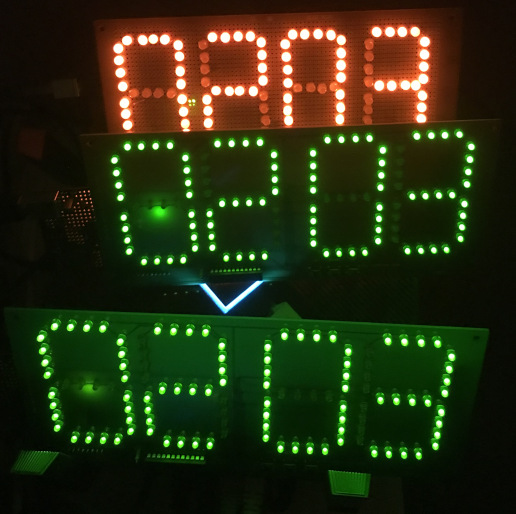

# The Most Useless Clock in the World (version 1)

Super expensive and super janky Arduino-based desktop clock that tells the time and nothing else. It's one of my favorite projects, and although it's since been obsoleted, I'm releasing the files to those who would want to make their own.

# # Bill of Materials

* Arduino or similar ATMega328-based board
* DS1307+ RTC chip, with:
* * 32 kHz crystal
* * 2x 1k pullup resistors on the data bus
* * CR2032 or similar battery cell and holder
* * You must pull VBAT low with a resistor or else the DS1307 won't work (if no battery is connected). A 30k resistor will kill a fresh CR2032 cell within months, so pick a very high value resistor.
* MAX7219 LED matrix driver chip, with:
* * Appropriate configuration resistor
* 112x 5mm or 3mm LEDs (the cheaper, the better)
* The clock PCB itself (send the gerbers off to your fab of choice)
* Whatever shit you need to wire everything together
* 3x tactile switches of some sort

# # Assembly

Pins below are Arduino signals.

* Up button to A1
* Down button to A2
* Set button to A3
* MAX7219 to appropriate SPI pins
* MAX7219 CE signal to pin 10
* DS1307 I2C bus to appropriate I2C pins

Compile the provided clock.ino and upload it to your ATMega328. Wire everything up. Test accordingly.

clock.ino requires the RTClib and AceSegment libraries to compile. A hexfile is provided for people who are lazy.

# # How to use

When you are sure that everything's setup correctly, then plug the USB cable into the control board. The clock should then flash "2022". It is now prompting for you to set the date and time. Use the Up and Down buttons to change the value, and press Set to confirm. The date will be prompted as follows: Year, Month, Day, Hour and Minute.

Once the time is set, the clock will store the given date/time information, and then begin functioning as a clock. In clock mode, the three buttons function as follows.
* Up will change the brightness of the clock. Pressing this button lowers the brightness. If the brightness can't go any lower, then the clock will reset to full brightness.
* Down will display the date. Pressing it once displays the year, pressing it twice displays the month, pressing it a third time displays the day. After a while, the clock will return to displaying the time.
* Holding Set for several seconds will allow you to set the date and time again.

Note that when your clock is operating, it will tend to run faster or slower than the actual time. This is called "clock drift" and unfortunately is a feature of all real time clocks. Depending on the design I used, your clock may go out of sync gradually or quickly. In that case, simply reset the time.

Think of your clock as a household plant that you take care of on the regular. It's a beautiful thing that deserves not only your attention, but your care and respect.

# # Known improvements

Everything.

The Raspberry Pi Pico eliminates need for a separate matrix driver chip, can sync time over Wi-Fi, and is around the same cost as a single ATMega328. Using a Pico saves $40-50 easily, which is why I'm abandoning this old design.

# # License

Public domain

# # Technical support

None provided; you're on your own.
